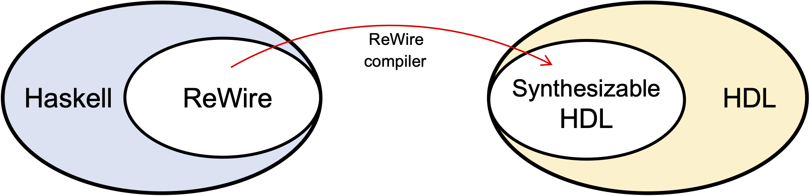
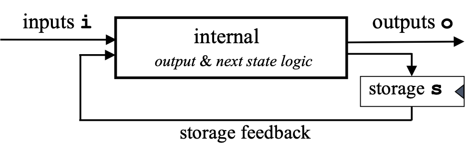

# Hello Worlds

This first chapter introduces ReWire and collects the simplest possible examples.

## What is ReWire?

ReWire is a domain-specific language embedded in the Haskell functional programming language (<https://haskell.org>). *Every* ReWire program is a Haskell program that can be executed just as any other Haskell program. This fact is simple and also very powerful, because it means that development of a hardware design can proceed *incrementally*, one function at a time, with the resulting new code being type-checked and/or tested. Once a developer is satisfied with their ReWire design, they can compile it automatically into synthesizable HDLs (hardware definition languages) like Verilog, VHDL, and FIRRTL.

### Mealy Machines and ReWire types

There's a mental model of digital circuitry used by hardware designers known as a Mealy machine. The flavor favored by hardware designers is portrayed below, which will seem odd to those of us who first heard of them from a class in theoretical computer science (e.g., <https://en.wikipedia.org/wiki/Mealy_machine>). Mealy machines are finite state machines combined with a clock that on each clock "tick" consume an input of type ``i``, update a store of type ``s``, and produce an output of type ``o``. 

In ReWire, there is a type corresponding to the Mealy machine above, the monadic type:

``ReacT i o (StateT s Identity) ()``

And, because it occurs so frequently, we refer to it as a *device type* some times. Things of this type are those that can be compiled to hardware. 

