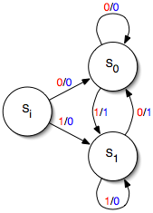

## Simple Mealy

The "theoretical computer science" picture of a Mealy machine is seen below:



Here ``si`` is the start state, and there are two other states, ``s0`` and ``s1``. There is also an alphabet consisting of ``0`` and ``1``. On the transitions, a red digit denotes an input and a blue digit denotes an output, so, in the machine is currently in state ``si`` and receives a ``1`` as input, it outputs a ``0`` and proceeds to state ``s1``. 

The ReWire code described in the section is found here, [SimpleMealy.hs](code/SimpleMealy.hs), and what follows is a line-by-line description.

First thing is to import a library with ReWire definitions, etc. What's ``DataKinds``? Don't worry about it for now. Collected in a comment is a tabular form of the state transitions.
```haskell
{-# LANGUAGE DataKinds #-}
import ReWire

-- Current State | Input | Output | Next State
-- --------------------------------------------
--    si             0       0          s0
--    si             1       0          s1
--    s0             0       0          s0
--    s0             1       1          s1
--    s1             0       1          s0
--    s1             1       0          s1
```

Next, let's define the alphabet:
```haskell
data Alphabet = Zero | One
```
``Alphabet`` defines both the inputs and outputs of this Mealy machine.

Each of the three states and their transitions are defined in the following. Before focusing on the type, note first how each line below corresponds directly to a line in the table above. E.g., if the machine is in state ``si`` and receives ``0`` as input, it produces output ``0``, and proceeds to state ``s0``.
```haskell
si , s0 , s1 :: Alphabet -> ReacT Alphabet Alphabet Identity ()

si Zero = signal Zero >>= s0
si One  = signal Zero >>= s1

s0 Zero = signal Zero >>= s0
s0 One  = signal One  >>= s1

s1 Zero = signal One  >>= s0
s1 One  = signal Zero >>= s1
```
We'll return to the types of ``si``, ``s0``, and ``s1`` momentarily.

Finally, we need to designate a start state, just as with any state machine definition.
```haskell
start :: ReacT Alphabet Alphabet Identity ()
start = signal Zero >>= si
```

#### Why this type ``ReacT Alphabet Alphabet Identity ()``?

We know the type will have the form ``ReacT i o m a`` for some types ``i``, ``o``, and ``a`` and monad ``m``. 
- The input alphabet is ``Alphabet``, so ``i`` is ``Alphabet``. 
- The output alphabet is ``Alphabet``, so ``o`` is also ``Alphabet``. 
- We are not using internal storage like registers, so monad ``m`` can be just ``Identity``. 

Finally, why ``()`` for return type ``a``? Here, we have a choice, but it doesn't matter in the least what we pick. Because ``start`` never, ever, terminates under any circumstances, it won't ever return any value, so we may as well pick ``()``.

This non-termination requirement on ``start`` is important and makes complete sense if you think about it. Hardware **never** terminates (unless it's unplugged).
